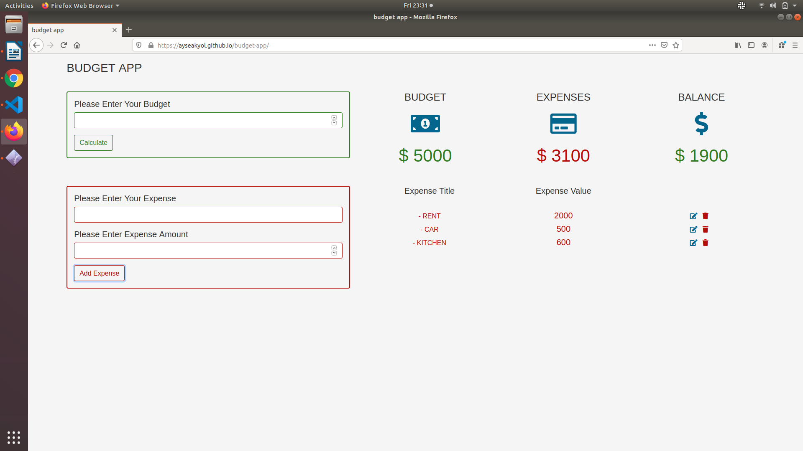

# Budget-App
FreeCodeCamp

A static web page for calculation built with only HTML, CSS & JavaScript.

Try the live demo [right here](https://ayseakyol.github.io/budget-app/), it looks something like this:

---

## Notes

Studying this project I learned about:

* es6 classes
* Using the constructor
* Using `setTimeOut`

---

> * Code refactored from [FreeCodeCamp](https://www.youtube.com/watch?v=m_HJ3juuFvo)

